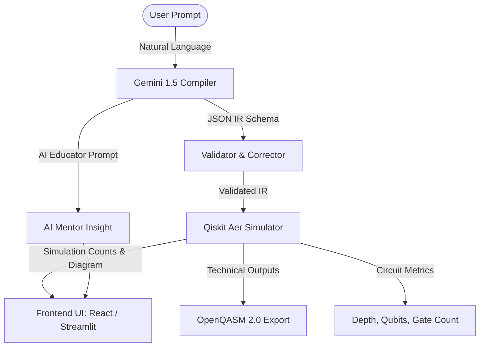

# ⚛️ AQC-GA: AI-Powered Quantum Circuit Generation & Analysis

AQC-GA is a state-of-the-art **Quantum Circuit Architect and Simulator** that translates natural language descriptions of quantum experiments into executable quantum circuits. It provides real-time simulation, state probabilities, visual ASCII circuit diagrams, QASM 2.0 technical export, and AI-driven explanations of the quantum state behaviors.

---

## 🌟 Key Features

*   **Natural Language Compilation:** Write descriptions like *"Create a 3-qubit GHZ state and measure all qubits"* and watch the system construct the correct gates automatically.
*   **Dual-Frontend Interface:**
    *   **Vite + React Web App:** A premium, modern, interactive dark-mode dashboard styled with Tailwind CSS.
    *   **Streamlit Dashboard:** A robust, single-file python frontend ideal for rapid prototyping and local scientific usage.
*   **Dual-Engine Pipeline:**
    *   **AI Engine (Gemini 1.5 Flash):** Compiles prompt inputs to custom JSON Intermediate Representation (IR) schemas and acts as an "AI Mentor" providing code explanations.
    *   **Quantum Engine (Qiskit Aer):** Simulates the generated circuits locally using classical hardware emulation and extracts state frequencies, diagrams, and OpenQASM code.
*   **Interactive Visualizations:** View state probabilities, trace measurement statistics, copy/paste technical QASM code, or analyze the JSON IR.

---

## 🏗️ Architecture Pipeline



---

## 📂 Project Structure

```
AQC-GA/
├── app.py                      # Streamlit Frontend application
├── requirements.txt            # Python backend & Streamlit dependencies
├── .gitignore                  # Global repository ignore file
├── backend/
│   ├── main.py                 # FastAPI server (Uvicorn gateway)
│   ├── .env                    # Local environment variables (API keys)
│   └── services/
│       ├── ai_engine.py        # Gemini translation & Educator integration
│       ├── quantum_engine.py   # Qiskit circuit builder and Aer simulator
│       └── validator.py        # JSON IR Schema validation and correction
└── frontend/                   # Vite + React Web Application
    ├── src/
    │   ├── App.jsx             # React application logic and interface
    │   ├── index.css           # Global layout styling
    │   └── main.jsx            # React root mount point
    ├── package.json            # React node dependencies
    └── vite.config.js          # Vite configuration file
```

---

## 🚀 Setup & Installation

### 1. Prerequisites
Make sure you have the following installed:
*   [Python 3.8+](https://www.python.org/downloads/)
*   [Node.js (v16+)](https://nodejs.org/) (Required only for the React Web App frontend)

### 2. Clone and Setup Environment
Navigate into your project folder and configure your Google AI API key:

Create a file named `.env` inside the `backend/` directory:
```bash
# File: backend/.env
GOOGLE_API_KEY=your_gemini_api_key_here
```
> Get your API key from [Google AI Studio](https://aistudio.google.com/).

### 3. Backend & Streamlit Setup
Install the Python dependencies:
```bash
pip install -r requirements.txt
```

#### Run FastAPI Server (Required for React App):
```bash
python backend/main.py
```
The API server will launch at `http://127.0.0.1:8000`.

#### Run Streamlit Frontend (Standalone alternative):
```bash
streamlit run app.py
```

### 4. React Frontend Setup (Recommended)
Open a new terminal window, navigate to the `frontend` directory, install Node packages, and run the developer server:
```bash
cd frontend
npm install
npm run dev
```
The React frontend will spin up locally at `http://localhost:5173`. Make sure the FastAPI backend is running simultaneously on port `8000`.

---

## 💡 Prompt Examples & Templates

To get started, try entering the following prompts:

| Name | Prompt Description |
| :--- | :--- |
| **Bell State** | *"Create a Bell state and measure both qubits"* |
| **GHZ State** | *"Create a 3-qubit GHZ state (H on 0, CNOT 0->1, CNOT 1->2)"* |
| **Superposition** | *"Apply Hadamard to qubit 0 and measure it"* |
| **Rotations** | *"Apply RX with pi/3 on qubit 0, followed by a Hadamard on qubit 1, and measure both"* |

---

## 🛠️ Tech Stack Details

*   **Quantum Core:** [IBM Qiskit](https://github.com/Qiskit/qiskit) & [Qiskit Aer Simulator](https://github.com/Qiskit/qiskit-aer)
*   **AI Backend:** [Google GenAI SDK](https://github.com/googleapis/google-genai-python)
*   **Web Framework (API):** [FastAPI](https://fastapi.tiangolo.com/) & [Uvicorn](https://www.uvicorn.org/)
*   **Frontend (Dashboard):** [React](https://react.dev/), [Vite](https://vitejs.dev/), [Tailwind CSS](https://tailwindcss.com/)
*   **Frontend (Prototyping):** [Streamlit](https://streamlit.io/)
